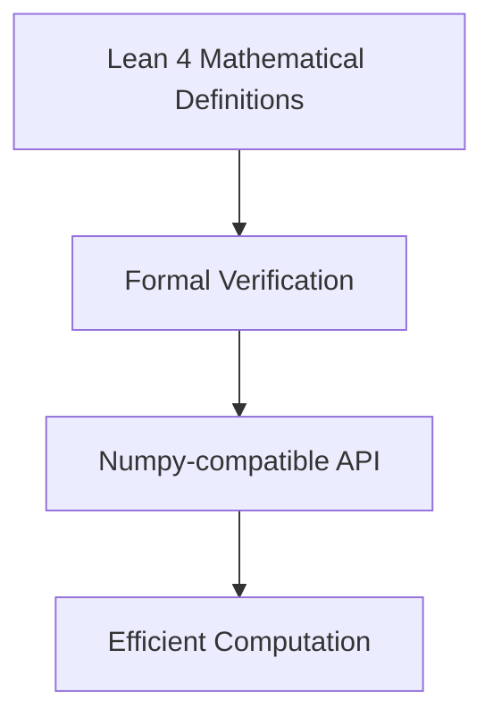

# CLAUDE.md

This file provides guidance to Claude Code (claude.ai/code) when working with code in this repository.

## Lean 4 / mathlib Naming Conventions

### Case Styles by Declaration Type

- **`snake_case`**: Terms of `Prop` (theorems, lemmas, proofs)
  - Example: `add_comm`, `lt_of_succ_le`
- **`UpperCamelCase`**: `Prop`s, `Type`s, inductive types, structures, classes
  - Example: `Nat`, `IsTopologicalRing`, `LinearOrder`
- **`lowerCamelCase`**: Most other terms (functions, definitions)
  - Example: `toString`, `mapFilter`
- Functions should be named like their return values

### Variable Naming Conventions

- Universes: `u`, `v`, `w`
- Generic types: `α`, `β`, `γ`, `δ`
- Elements of generic types: `x`, `y`, `z`
- Assumptions/hypotheses: `h`, `h₁`, `h₂`, ...
- Predicates and relations: `p`, `q`, `r`
- Natural numbers: `m`, `n`, `k`
- Integers: `i`, `j`, `k`
- Functions: `f`, `g`

### Theorem and Lemma Naming Patterns

- Describe the conclusion concisely
- Use `_of_` to indicate "derived from"
- Order: conclusion first, then hypotheses
- Example: `lt_of_succ_le` means "less than, derived from successor ≤"

### Special Suffixes and Prefixes

- Extensionality: `.ext`
- Injectivity: `_injective` or `_inj`
- Induction principles: include `induction`
- Recursive principles: include `rec`
- Simplification lemmas: `_simp`
- Constructor lemmas: `mk`

### Predicate and Class Naming

- Predicates on types typically use prefixes (e.g., `isClosed_Icc`)
- Prop-valued classes:
  - Use `Is` prefix for noun-like classes: `IsTopologicalRing`
  - Adjective-like classes can omit `Is`: `Normal`, `Finite`

### Common Patterns

- `intro` lemmas: Introduce a property (e.g., `continuous_intro`)
- `elim` lemmas: Eliminate/use a property
- `_iff_` for bi-implications
- `_imp_` for implications
- `_eq_` for equalities
- `_ne_` for inequalities

### Practical Examples

```lean
-- Good theorem names
theorem add_le_add_left (a b c : ℕ) (h : a ≤ b) : c + a ≤ c + b := ...
theorem map_injective_of_injective (f : α → β) (g : β → γ) : ...

-- Good definition names
def IsEven (n : ℕ) : Prop := ∃ k, n = 2 * k
def mapWithIndex (f : ℕ → α → β) : List α → List β := ...
```

### Key Principles

- Prioritize clarity and mathematical intuition
- Be consistent with existing mathlib patterns
- Make names predictable and searchable
- Avoid abbreviations unless standard in mathematics
- Use Unicode operators appropriately (≤, ∈, ∀, etc.)

## NumpySpec Project Overview

**Main Goal**: Port numpy functionality to Lean 4 with formal verification, starting with Gaussian elimination as a foundation for linear algebra operations.

The project focuses on creating a formally verified mathematical library that provides numpy-like functionality in Lean 4, emphasizing correctness through theorem proving while maintaining computational efficiency.

### Core Architecture



**Key Components:**

- **Mathematical Core** (`NumpySpec.lean`, `NumpySpec/`): Core linear algebra definitions and theorems
- **Numerical Types** (`BignumLean.lean`): Bignum and bitvector arithmetic for numerical computing
- **Verification**: Formal proofs ensuring correctness of numerical algorithms

### Files Unrelated to Core Numpy Porting Goal

The following files have drifted from the main objective and can be considered for removal or archival:

**Cloud Infrastructure** (can be re-introduced later):

- `src/numpyspec/lean_server.py` - MorphCloud/Pantograph remote compilation
- `src/numpyspec/subagents.py` - Remote build agents
- `src/numpyspec/agent.py` - Cloud orchestration

**Textbook/Educational Content** (dead/obsolete):

- `textbook/` - Numerical Recipes PDFs
- `generated/versobook/` - Verso documentation system
- `_out/` - Generated HTML docs

**Reinforcement Learning** (upcoming integration):

- `src/numpyspec/rl_env.py` - RL training environment for theorem proving
- `src/numpyspec/rl_trainer.py` - PPO trainer for proof search
- `models/ppo_leanenv.zip` - Trained RL model

**Progress Presentation System** (management reporting):

- `FuncTracker.lean` and `FuncTracker/` directory - ASCII table parsing for presenting development progress to management in Lean

**Development/Setup Scripts** (may need cleanup):

- Various setup and installation scripts
- OCR-related files (`plan.md`, `notes.md`)
- Browser logs and test reports

## Development Commands

### Building and Testing

```bash
# Local Lean build (primary workflow)
lake build

# Run tests
uv run -m pytest -q

# Check Lean syntax and types
lake build --verbose
```

## Numpy Port Roadmap

To provide a clear, actionable plan for porting numpy-style linear algebra to Lean 4, this roadmap addresses core matrix types, verification strategy, API design, and next implementation steps.

### 1. Matrix Types and Core Operations

- **Dense matrices** (`Matrix (m : Nat) (n : Nat) α`): fixed-size, nested `Fin`-indexed `Vec` or `Array`.
- **Sparse matrices** (`SparseMatrix α`): map-based representation for mostly-zero data.
- **Block matrices & views**: support submatrix slicing and block composition.
- **Key operations to port first**:
  - Matrix multiplication (`mmul`)
  - Transpose (`transpose`)
  - LU decomposition / Gaussian elimination (`lu` / `gaussianElim`)
  - Linear solve (`solve`)
  - Determinant (`determinant`) and inverse (`inverse`)

### 2. Verification vs. Performance Strategy

- **Spec vs. Exec separation**: `MatrixSpec` module for pure proofs; `MatrixExec` for efficient code.
- **Refinement proofs**: each executable function has a correctness theorem linking back to the spec.
- **Performance tuning**: use Lean 4 `Array`/`UArray`, `@[inline]`, and `@[specialize]` pragmas for critical loops.
- **Numeric backend**: integrate `BignumLean` and bitvectors for safe low-level arithmetic.

### 3. Numpy-Compatible API Design

- **Indexing & shape**: 0-based `(i, j)`, `.shape : (m, n)` accessor.
- **Operator overloading**: `*`, `+`, `-`, `.*`, `./` with standard Lean typeclass instances (`Mul`, `Add`, …).
- **Constructors / converters**:
  - `Matrix.ofList` / `SparseMatrix.ofList`: from nested lists.
  - `.toList`: back to Lean lists.
- **Convenience methods**: `.T` for transpose, `.dot` for inner products, broadcasting helpers later.

### 4. Next Steps

1. **Core types**: implement `Matrix` & `SparseMatrix` in `NumpySpec.Matrix`.
2. **Spec module**: define `mmul_spec`, `lu_spec`, `solve_spec`, etc. with `theorem …_correct`.
3. **Exec module**: write executable versions, prove `refines` the spec.
4. **API layer**: add `NumpySpec.NumpyCompat` exporting constructors, notation, and overloaded ops.
5. **Benchmark & test**: small-scale benchmarks (`#eval`, `timeIt`) and `pytest` examples in Python.
6. **Docs & examples**: notebook-style tutorials showing numpy-to-Lean translation.
7. **Iterate**: profile, optimize, and extend to broadcasting & batched operations.

## Lean Development Guidelines

### Import and Module Structure

- Imports MUST come before any syntax elements, including module and doc comments
- Use `import LeanSearchClient` for theorem search capabilities
- Set `linter.missingDocs = true` and `relaxedAutoImplicit = false` in lakefile.toml

### Common Errors and Solutions

- **"unexpected token 'namespace'"**: Module/doc comment placed incorrectly (should be after imports)
- **"unexpected token"**: Often caused by misplaced docstrings - use multiline comments instead
- **Build failures**: Run `lake build` locally before committing to catch syntax errors

### Theorem Search

```lean
-- String queries must end with period
#search "nonsingular."

-- Loogle uses type notation
#loogle List ?a -> ?a
```

### Project-Specific Patterns

- Use named holes (`?foo`) for incremental development
- Wrap reserved names in «guillemets» when needed
- Follow the DeepSeek approach: decompose proofs into `have` statements with `sorry` placeholders

## Working with Generated Code

The project can generate Lean files in the `generated/` directory:

- Root import file: `generated/Spec/Spec.lean`

These are built separately from the main package - use `lake build Generated` or `just build-all`.

## Additional Guidelines

- Always use `uv` for Python package management (not pip)
- Run `lake build` before committing Lean changes
- Use `rg` and `fd` instead of grep/find
- Make atomic commits and use branches liberally
- Focus on mathematical correctness over performance optimization initially

### General Programming Philosophy

Programming is about onomastics (naming), composition (functoriality), and caching. Think conformally at every scale and across scales.

Build a pit of success: internal systems that grow as a whole outwards, never allowing the fallible external world to leak in except at boundaries. Meet the external world at well-defined interfaces.

When solving problems, write tooling/linters/auto-fixers to widen the pit of success. Use rigid compiler error messages and linter warnings to guide future users (including AI) toward correct solutions.

Favor statically typed functional programming but use mutability where it makes sense or is easier to port.

## Development Strategies

### Lean 4 Development Approach

- Read the reference manual assiduously. Ultrathink.
- Figure out the parser by interactively building up toy components.
- Install `uvx lean-lsp-mcp` and spam it to get intermediate state (not just tactics).
- Spam it to verify the pieces work and build up FUNCTORIALLY.
- You are a functional programmer
- Use compiler tooling like extensible error messages, `simproc` (pattern guided reductions), and metaprogramming for pit of success
- If you solve a hard problem, write a tactic or simproc to pave the way
- Try harder to index without `!` or `?` - name `match`/`if` branches for better inference
- Raw string syntax: `r#".."#`, multiline strings use `\` continuation
- Use `lakefile.lean` over `lakefile.toml` for better AI introspection and metaprogramming
- Incorporate positive surprises into memories - stay curious!

### Debugging and Development Process

- Use named holes like `?holeName` for well-typed fragment programs
- Make mermaid diagrams with labeled edges describing data flow
- Category theory wiring diagram style for complex systems
- Apply the scientific method for debugging

## Numpy Porting Progress

### Current Status

- ✓ **Gaussian Elimination Foundation**: Basic linear algebra structure in `NumpySpec.lean`
- ✓ **Numerical Types**: Bitvector arithmetic and bignum support in `BignumLean.lean`
- ✓ **Build System**: Lake configuration for Lean 4 mathematics

### Next Priorities for Numpy Porting

1. **Matrix Types**: Define matrix structures compatible with numpy's ndarray
2. **Linear Algebra Operations**: Implement core operations (dot product, matrix multiplication, etc.)
3. **Broadcasting**: Implement numpy-style broadcasting semantics
4. **Numerical Stability**: Add error analysis and numerical stability theorems
5. **API Compatibility**: Create numpy-compatible function signatures

### Design Principles

- **Correctness First**: Every operation should have formal verification
- **Performance Later**: Focus on mathematical correctness before optimization
- **Compositionality**: Build complex operations from verified primitives
- **Type Safety**: Use Lean's type system to prevent numerical errors

## Development Tools and Workflow

### Task Delegation

- Use `codex` for delegating tasks to sub-agents: `codex -q --project-doc CLAUDE.md -a full-auto "<task>"`
- Sub-agents can recursively invoke other sub-agents
- Use `terminal-notifier` to get completion notifications

### Version Control

**Jujutsu (jj) Setup for GitHub-friendly Development:**

- Use `jj git init --colocate` for existing git repos (recommended for this project)
- Colocated repos automatically sync jj and git on every command
- Enables mixing `jj` and `git` commands seamlessly
- Tools expecting `.git` directory continue to work

**Essential jj configuration:**
```bash
jj config edit --user
```

Add these settings:
```toml
[git]
auto-local-bookmark = true  # Import all remote bookmarks automatically

[snapshot]  
auto-update-stale = true    # Auto-update stale working copies when switching contexts
```

**Key workflow improvements over git:**
- Anonymous branches - no need to name every small change
- Better conflict resolution and interactive rebase
- `jj absorb` automatically squashes changes into relevant ancestor commits
- `jj undo` and `jj op restore` for powerful history manipulation
- Empty commit on top by default (enables easier experimentation)

**GitHub integration commands:**
- `jj git fetch` + `jj rebase -d main` (replaces `git pull`)
- `jj bookmark create <name>` for named branches
- SSH keys recommended for GitHub (as of Oct 2023)
- Support for both "add commits" and "rewrite commits" review workflows

```
