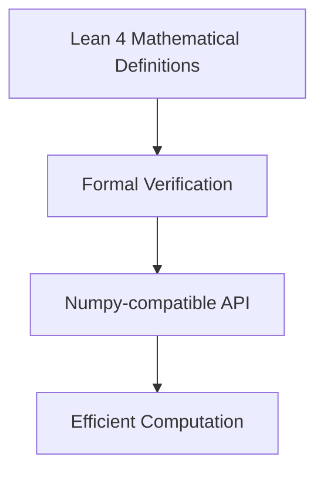

# CLAUDE.md

This file provides guidance to Claude Code (claude.ai/code) when working with code in this repository.

## Lean 4 / mathlib Naming Conventions

### Case Styles by Declaration Type
- **`snake_case`**: Terms of `Prop` (theorems, lemmas, proofs)
  - Example: `add_comm`, `lt_of_succ_le`
- **`UpperCamelCase`**: `Prop`s, `Type`s, inductive types, structures, classes
  - Example: `Nat`, `IsTopologicalRing`, `LinearOrder`
- **`lowerCamelCase`**: Most other terms (functions, definitions)
  - Example: `toString`, `mapFilter`
- Functions should be named like their return values

### Variable Naming Conventions
- Universes: `u`, `v`, `w`
- Generic types: `α`, `β`, `γ`, `δ`
- Elements of generic types: `x`, `y`, `z`
- Assumptions/hypotheses: `h`, `h₁`, `h₂`, ...
- Predicates and relations: `p`, `q`, `r`
- Natural numbers: `m`, `n`, `k`
- Integers: `i`, `j`, `k`
- Functions: `f`, `g`

### Theorem and Lemma Naming Patterns
- Describe the conclusion concisely
- Use `_of_` to indicate "derived from"
- Order: conclusion first, then hypotheses
- Example: `lt_of_succ_le` means "less than, derived from successor ≤"

### Special Suffixes and Prefixes
- Extensionality: `.ext`
- Injectivity: `_injective` or `_inj`
- Induction principles: include `induction`
- Recursive principles: include `rec`
- Simplification lemmas: `_simp`
- Constructor lemmas: `mk`

### Predicate and Class Naming
- Predicates on types typically use prefixes (e.g., `isClosed_Icc`)
- Prop-valued classes:
  - Use `Is` prefix for noun-like classes: `IsTopologicalRing`
  - Adjective-like classes can omit `Is`: `Normal`, `Finite`

### Common Patterns
- `intro` lemmas: Introduce a property (e.g., `continuous_intro`)
- `elim` lemmas: Eliminate/use a property
- `_iff_` for bi-implications
- `_imp_` for implications
- `_eq_` for equalities
- `_ne_` for inequalities

### Practical Examples
```lean
-- Good theorem names
theorem add_le_add_left (a b c : ℕ) (h : a ≤ b) : c + a ≤ c + b := ...
theorem map_injective_of_injective (f : α → β) (g : β → γ) : ...

-- Good definition names
def IsEven (n : ℕ) : Prop := ∃ k, n = 2 * k
def mapWithIndex (f : ℕ → α → β) : List α → List β := ...
```

### Key Principles
- Prioritize clarity and mathematical intuition
- Be consistent with existing mathlib patterns
- Make names predictable and searchable
- Avoid abbreviations unless standard in mathematics
- Use Unicode operators appropriately (≤, ∈, ∀, etc.)

## GaussianSpec Project Overview

**Main Goal**: Port numpy functionality to Lean 4 with formal verification, starting with Gaussian elimination as a foundation for linear algebra operations.

The project focuses on creating a formally verified mathematical library that provides numpy-like functionality in Lean 4, emphasizing correctness through theorem proving while maintaining computational efficiency.

### Core Architecture



**Key Components:**
- **Mathematical Core** (`GaussianSpec.lean`, `GaussianSpec/`): Core linear algebra definitions and theorems
- **Numerical Types** (`BignumLean.lean`): Bignum and bitvector arithmetic for numerical computing
- **Verification**: Formal proofs ensuring correctness of numerical algorithms

### Files Unrelated to Core Numpy Porting Goal

The following files have drifted from the main objective and can be considered for removal or archival:

**Cloud Infrastructure** (can be re-introduced later):
- `src/gaussianspec/lean_server.py` - MorphCloud/Pantograph remote compilation
- `src/gaussianspec/subagents.py` - Remote build agents
- `src/gaussianspec/agent.py` - Cloud orchestration

**Textbook/Educational Content** (dead/obsolete):
- `textbook/` - Numerical Recipes PDFs
- `generated/versobook/` - Verso documentation system
- `_out/` - Generated HTML docs

**Reinforcement Learning** (separate research direction):
- `src/gaussianspec/rl_env.py` - RL training environment
- `src/gaussianspec/rl_trainer.py` - PPO trainer
- `models/ppo_leanenv.zip` - Trained RL model

**Table Parsing System** (separate project):
- `FuncTracker.lean` and `FuncTracker/` directory - ASCII table parsing, unrelated to numpy

**Development/Setup Scripts** (may need cleanup):
- Various setup and installation scripts
- OCR-related files (`plan.md`, `notes.md`)
- Browser logs and test reports

## Development Commands

### Building and Testing
```bash
# Local Lean build (primary workflow)
lake build

# Run tests
uv run -m pytest -q

# Check Lean syntax and types
lake build --verbose
```

### Development Focus
- **Priority 1**: Core mathematical definitions in `GaussianSpec.lean` and `GaussianSpec/` directory
- **Priority 2**: Numerical types and arithmetic in `BignumLean.lean`
- **Priority 3**: Theorem proving and verification of numerical algorithms
- **Deferred**: Cloud infrastructure, RL training, documentation systems

## Lean Development Guidelines

### Import and Module Structure
- Imports MUST come before any syntax elements, including module and doc comments
- Use `import LeanSearchClient` for theorem search capabilities
- Set `linter.missingDocs = true` and `relaxedAutoImplicit = false` in lakefile.toml

### Common Errors and Solutions
- **"unexpected token 'namespace'"**: Module/doc comment placed incorrectly (should be after imports)
- **"unexpected token"**: Often caused by misplaced docstrings - use multiline comments instead
- **Build failures**: Run `lake build` locally before committing to catch syntax errors

### Theorem Search
```lean
-- String queries must end with period
#search "nonsingular."

-- Loogle uses type notation
#loogle List ?a -> ?a
```

### Project-Specific Patterns
- Use named holes (`?foo`) for incremental development
- Wrap reserved names in «guillemets» when needed
- Follow the DeepSeek approach: decompose proofs into `have` statements with `sorry` placeholders

## Working with Generated Code

The project can generate Lean files in the `generated/` directory:
- Root import file: `generated/Spec/Spec.lean`

These are built separately from the main package - use `lake build Generated` or `just build-all`.

## Additional Guidelines
- Always use `uv` for Python package management (not pip)
- Run `lake build` before committing Lean changes
- Use `rg` and `fd` instead of grep/find
- Make atomic commits and use branches liberally
- Focus on mathematical correctness over performance optimization initially

## Development Strategies

### Lean 4 Development Approach
- Read the reference manual more assiduously. ultrathink. 
- Figure out the parser by interactively building up toy components. 
- Install `uvx lean-lsp-mcp` and spam it to get intermediate state (not just tactics). 
- Spam it to verify the pieces work and build up FUNCTORIALLY. 
- You are a functional programmer

## Numpy Porting Progress

### Current Status
- ✓ **Gaussian Elimination Foundation**: Basic linear algebra structure in `GaussianSpec.lean`
- ✓ **Numerical Types**: Bitvector arithmetic and bignum support in `BignumLean.lean`
- ✓ **Build System**: Lake configuration for Lean 4 mathematics

### Next Priorities for Numpy Porting
1. **Matrix Types**: Define matrix structures compatible with numpy's ndarray
2. **Linear Algebra Operations**: Implement core operations (dot product, matrix multiplication, etc.)
3. **Broadcasting**: Implement numpy-style broadcasting semantics
4. **Numerical Stability**: Add error analysis and numerical stability theorems
5. **API Compatibility**: Create numpy-compatible function signatures

### Design Principles
- **Correctness First**: Every operation should have formal verification
- **Performance Later**: Focus on mathematical correctness before optimization
- **Compositionality**: Build complex operations from verified primitives
- **Type Safety**: Use Lean's type system to prevent numerical errors
```