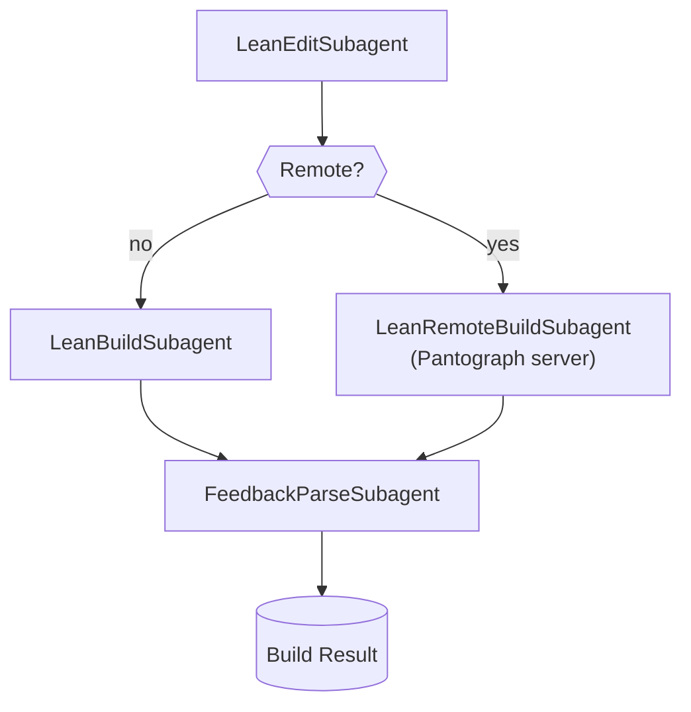

# CLAUDE.md

This file provides guidance to Claude Code (claude.ai/code) when working with code in this repository.

## Lean 4 / mathlib Naming Conventions

### Case Styles by Declaration Type
- **`snake_case`**: Terms of `Prop` (theorems, lemmas, proofs)
  - Example: `add_comm`, `lt_of_succ_le`
- **`UpperCamelCase`**: `Prop`s, `Type`s, inductive types, structures, classes
  - Example: `Nat`, `IsTopologicalRing`, `LinearOrder`
- **`lowerCamelCase`**: Most other terms (functions, definitions)
  - Example: `toString`, `mapFilter`
- Functions should be named like their return values

### Variable Naming Conventions
- Universes: `u`, `v`, `w`
- Generic types: `α`, `β`, `γ`, `δ`
- Elements of generic types: `x`, `y`, `z`
- Assumptions/hypotheses: `h`, `h₁`, `h₂`, ...
- Predicates and relations: `p`, `q`, `r`
- Natural numbers: `m`, `n`, `k`
- Integers: `i`, `j`, `k`
- Functions: `f`, `g`

### Theorem and Lemma Naming Patterns
- Describe the conclusion concisely
- Use `_of_` to indicate "derived from"
- Order: conclusion first, then hypotheses
- Example: `lt_of_succ_le` means "less than, derived from successor ≤"

### Special Suffixes and Prefixes
- Extensionality: `.ext`
- Injectivity: `_injective` or `_inj`
- Induction principles: include `induction`
- Recursive principles: include `rec`
- Simplification lemmas: `_simp`
- Constructor lemmas: `mk`

### Predicate and Class Naming
- Predicates on types typically use prefixes (e.g., `isClosed_Icc`)
- Prop-valued classes:
  - Use `Is` prefix for noun-like classes: `IsTopologicalRing`
  - Adjective-like classes can omit `Is`: `Normal`, `Finite`

### Common Patterns
- `intro` lemmas: Introduce a property (e.g., `continuous_intro`)
- `elim` lemmas: Eliminate/use a property
- `_iff_` for bi-implications
- `_imp_` for implications
- `_eq_` for equalities
- `_ne_` for inequalities

### Practical Examples
```lean
-- Good theorem names
theorem add_le_add_left (a b c : ℕ) (h : a ≤ b) : c + a ≤ c + b := ...
theorem map_injective_of_injective (f : α → β) (g : β → γ) : ...

-- Good definition names
def IsEven (n : ℕ) : Prop := ∃ k, n = 2 * k
def mapWithIndex (f : ℕ → α → β) : List α → List β := ...
```

### Key Principles
- Prioritize clarity and mathematical intuition
- Be consistent with existing mathlib patterns
- Make names predictable and searchable
- Avoid abbreviations unless standard in mathematics
- Use Unicode operators appropriately (≤, ∈, ∀, etc.)

## GaussianSpec Project Overview

GaussianSpec is a cloud-native Lean 4 research playground that formally specifies Gaussian elimination as producing the left inverse of a nonsingular matrix. The project uses remote Pantograph servers for compilation, enabling millisecond-latency verification for RL agents.

### Core Architecture



**Key Components:**
- **Subagent System** (`src/gaussianspec/subagents.py`): Modular agents for editing, building, and parsing
- **Remote Compilation** (`src/gaussianspec/lean_server.py`): Pantograph HTTP API integration via MorphCloud
- **RL Environment** (`src/gaussianspec/rl_env.py`): Gymnasium environment for training agents

## Development Commands

### Building and Testing
```bash
# Install dependencies (Python + Lean)
just sync

# Local Lean build (default target)
just build-local  # or: lake build

# Build ALL targets including Generated namespace
just build-all    # runs: lake build && lake build generated

# Run tests
just test         # runs: uv run -m pytest -q

# Linting and formatting
just lint         # runs: uv run ruff check --fix . && uv run ruff format .
```


### Working with Individual Components
```bash
# Train RL agent
just train steps='1000'
```

## Lean Development Guidelines

### Import and Module Structure
- Imports MUST come before any syntax elements, including module and doc comments
- Use `import LeanSearchClient` for theorem search capabilities
- Set `linter.missingDocs = true` and `relaxedAutoImplicit = false` in lakefile.toml

### Common Errors and Solutions
- **"unexpected token 'namespace'"**: Module/doc comment placed incorrectly (should be after imports)
- **"unexpected token"**: Often caused by misplaced docstrings - use multiline comments instead
- **Build failures**: Run `lake build` locally before committing to catch syntax errors

### Theorem Search
```lean
-- String queries must end with period
#search "nonsingular."

-- Loogle uses type notation
#loogle List ?a -> ?a
```

### Project-Specific Patterns
- Use named holes (`?foo`) for incremental development
- Wrap reserved names in «guillemets» when needed
- Follow the DeepSeek approach: decompose proofs into `have` statements with `sorry` placeholders

## Working with Generated Code

The project can generate Lean files in the `generated/` directory:
- Root import file: `generated/Spec/Spec.lean`

These are built separately from the main package - use `lake build Generated` or `just build-all`.

## Remote Compilation

The project uses Pantograph servers on MorphCloud for fast, scalable compilation:
- First run provisions an Infinibranch snapshot (~5 min)
- Subsequent runs reuse the warmed instance
- Remote compilation provides fast feedback for RL agents

## Additional Guidelines
- Always use `uv` for Python package management (not pip)
- Run `lake build` before committing Lean changes
- Use `rg` and `fd` instead of grep/find
- Make atomic commits and use branches liberally

## Development Strategies

### Lean 4 Development Approach
- Read the reference manual more assiduously. ultrathink. 
- Figure out the parser by interactively building up toy components. 
- Install `uvx lean-lsp-mcp` and spam it to get intermediate state (not just tactics). 
- Spam it to verify the pieces work and build up FUNCTORIALLY. 
- You are a functional programmer

## FuncTracker Development Progress

### Completed Features
- ✓ **Compositional Table Parser**: ASCII table parsing with box-drawing characters using Parsec combinators
- ✓ **Compile-time Validation**: Function name validation at elaboration time with helpful error messages
- ✓ **Type-safe Data Structures**: Status tracking with Progress computation and table manipulation
- ✓ **Custom Elaborator**: `funcTable!` syntax with environment-aware identifier checking

### Next Feature: Predicate Region Checking
**Goal**: Implement semantic validation for table regions based on predicates

The next development phase will add compositional predicate checking to table regions:
- **Region Predicates**: Define predicates that apply to rectangular regions of the table
- **Semantic Validation**: Check relationships between cells (e.g., tested functions should have test files)
- **Compositional Checking**: Build complex region checks from simple predicate combinators
- **Error Localization**: Report validation errors with precise table coordinates

**Design Approach**: Follow the same compositional parser pattern but for semantic validation.
Build small predicate combinators that can be composed into larger region checkers.
```