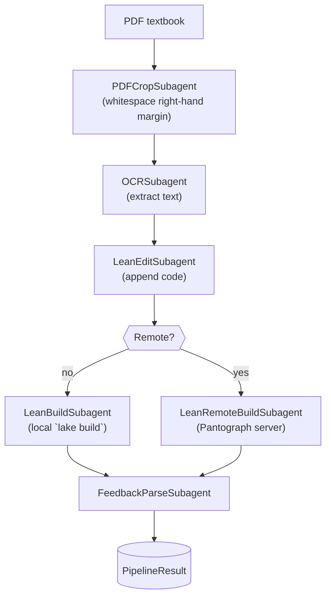
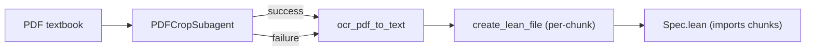

## End-to-End Lean Agent Pipeline

Below is a high-level overview of the *concrete* agent pipeline implemented in
`gaussianspec.pipeline`.

### Category-Theory Flavour (optional 🤓)

Consider each box an *arrow* (morphism) acting on its input *object* (file or
data structure).  The composite morphism is the ordered product

\[
    G =  \text{FeedbackParse} \circ \text{Build} \circ \text{Edit}
        \circ \text{OCR} \circ \text{Crop}
\]

which maps the initial *PDF* object to a rich structured *PipelineResult*.
The diagram above is therefore a wiring diagram of that composite, where the
`Remote?` diamond is a *coproduct*-like branching.

Feel free to extend or refine this diagram as the pipeline evolves. 

## `pdf_pipeline.py` Flow (OCR Preprocessor)

The standalone `gaussianspec.pdf_pipeline` script focuses on **fast OCR
pre-processing** for later Lean translation workflows.  Its high-level data
flow is:

Notes:

- The **cropping** stage is *idempotent*; if the cropped PDF already exists it
  is reused.
- `ocr_pdf_to_text` automatically selects the best OCR backend (OpenAI Vision →
  Gemini → Tesseract) unless the caller fixes one via CLI flag.
- For `--all` mode the diagram represents the repeated chunk loop, yielding
  multiple `ChunkXXXX_YYYY.lean` files that the generated `Spec.lean` imports.

This complements the **end-to-end agent pipeline** documented above and keeps
OCR preprocessing concerns fully separated. 